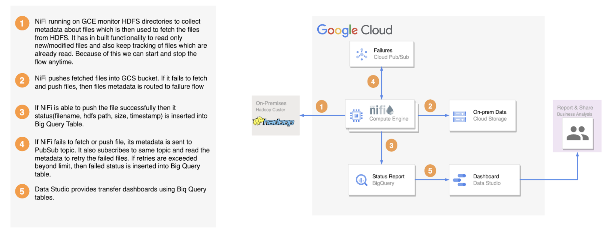
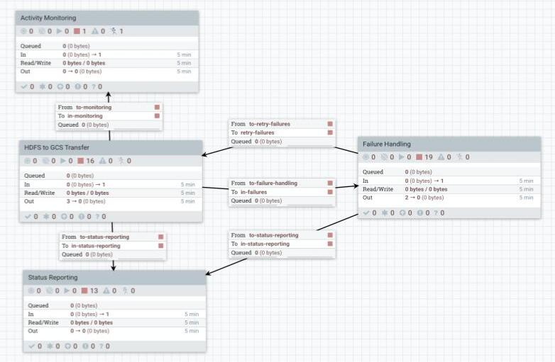
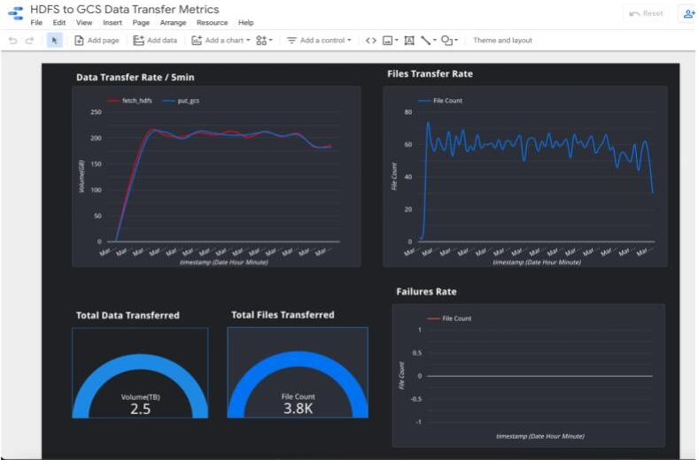

# HDFS to GCS (HDFS2GCS)  
A complete end to end solution to migrate data from traditional Hadoop clusters to Google Cloud Storage while providing a managed, fault tolerant, seamless experience. Solution is configurable/ customizable and has support for tracking, error handling, throttling, security, validation and monitoring.

## High level architecture 

## Features
- Support for large data transfers from HDFS to GCS
- Support for incremental/delta loads
- Fault tolerance
- Rate Throttling
- Checksum validation
- Checkpointing/Restartability
- Horizontal scalability
- Zero Coding effort
- Security using IAM, Kerberos, SSL
- Tracking and reporting of data transfer
- Support for Push & Pull model
- Highly configurable

## Supported Distributions
The full solution, including the use of crc32c checksums for transfer validation, is tested with Apache Hadoop 2.10 onwards, which corresponds to Hortonworks 3+ and Cloudera Data Hub 5+. However, the solution supports the transfer of data from earlier distributions of Hadoop without support for crc32c checksum.

## Prerequisites
1. GCP Service account with following permission to deploy the HDFS2GCS tool for Pull Mode and run flows 
	- Service account user role to use service compute role
	- Compute admin role to create and manage GCE VMs for tool deployment
	- BiqQuery admin role to create dataset and underlying tables, and to insert data for status reporting and failures
	- PubSub editor role to create topic, attach subscriber to it, and to store and retry failures
	- Storage admin role to create GCS buckets and objects

2. Account having access to DataStudio for dashboarding
3. Firewall rules/ports to open connectivity between on-prem cluster and GCE VMs
    |        Node        | Port |            Configuration            |
    |--------------------|------|-------------------------------------|
    | NameNode           | 8020 | fs.defaultFS or fs.default.name     |
    | NameNode           | 9870 | dfs.namenode.http-address           |
    | Secondary-NameNode | 9868 | dfs.namenode.secondary.http-address |
    | DataNode           | 9866 | dfs.datanode.address                |
    | DataNode           | 9865 | dfs.datanode.https.address          |
    | DataNode           | 9867 | dfs.datanode.ipc.address            |

4. Access to hadoop cluster to list and fetch files present in HDFS
	- core-site.xml
	- hdfs-site.xml
	- Kerberos credentials

5. Minimum hardware requirment is VMs with 4G memory. 
    -   Hardware Recommendation: 
        - Use persistent SSD disk types with 1024 GB capacity for large IOps. This is required since NiFi keeps flow related data in these disks and access that frequently.
        - Use high cpu compute instances for NiFi to get better performance.
        - Since ListHDFS stores files metadata in Heap, it is recommended to have a sufficient heap for a large number of files(Heap settings are in nifi.tf file). E.g. if we are transferring 5 million files, we may need ~25GB heap for each NiFi node. So, Select the machine type with sufficient memory to allocate the required heap.
        - Zookeeper and ca host can be very small.
        - We have tried this solution with “debian-10-buster-v20220406”, “centos-7-v20220406” and "ubuntu-1804-bionic-v20220419" images. 

## Deployment 
[Follow this guide for the deployment](./hdfs2gcs-terraform/README.md)

## Setup Hdfs to GCS transfer process
Once you lunch the NIFI web UI, modify below parameters and controller services.

## Parameters

| Parameter Name           | Description                                                                                  |
|--------------------------|----------------------------------------------------------------------------------------------|
| bq_dataset               | BigQuery data set name which contains tables for status and transfer reporting               |
| bq_failure_status_table  | BigQuery table name which stores metadata about the files which are failed during transfer   |
| bq_success_status_table  | BigQuery table name which stores metadata about the files which are transferred successfully |
| bq_transfer_rate_table   | BigQuery table name which stores data about transfer rate                                    |
| core-site                | Path to the hadoop core-site.xml file present on the NiFi nodes in the cluster               |
| gcp_project_id           | GCP project id where resources are deployed(GCE, GCS, BigQuery, PubSub)                      |
| hdfs-site                | Path to the hadoop hdfs-site.xml file present on the NiFi nodes in the cluster               |
| kerberos_keytab          | Path to kerberos keytab present on the NiFi nodes                                            |
| kerberos_principal       | Kerberos principal name to connect securely to hadoop cluster                                |
| nifi_api_uri             | NiFi api url                                                                                 |
| pub_sub_topic_name       | PubSub topic name to hold failed files metadata                                              |
| pub_sub_topic_sub        | PubSub topic subscription name to replay failures                                            |

## Controller Services

- GCPCredentialsControllerService : Set the path to service account credential file to access GCP resources (GCS, BigQuery, PubSub) in the flow.
- StandardRestrictedSSLContextService : Provide keystore/truststore settings to call NiFi rest api with secure SSL mechanism.

## Performance
You can create dashboards to visualize the data from BigQuery tables.

